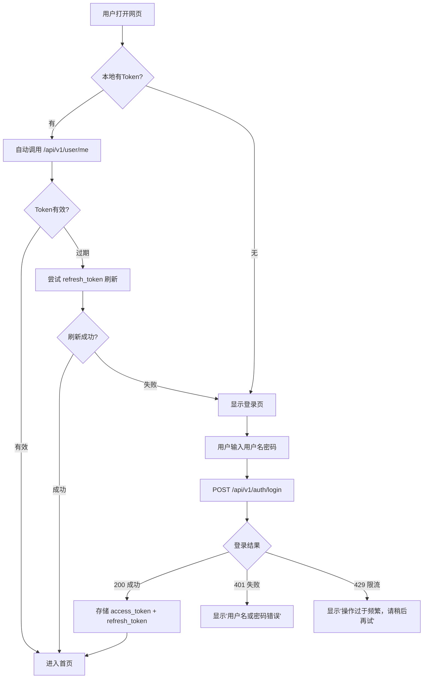
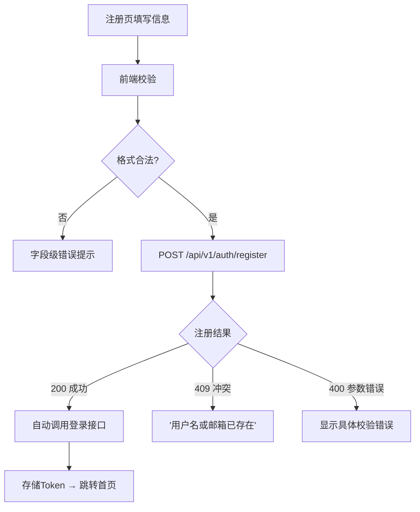
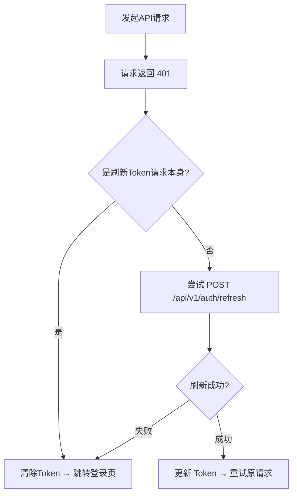

# HeecoMou Web 管理端 — 产品需求文档 (PRD)

> 版本：v1.0 | 日期：2026-05-24

---

## 1. 产品概述

HeecoMou Web 管理端是智能语音输入法的用户管理中心。用户通过浏览器即可完成账号注册、登录、个人资料管理、词库维护等操作，无需依赖手机 App。它是 HeecoMou 全平台（Android 输入法 + Windows 桌面端）的统一账号入口。

- **核心问题**：解决用户在没有手机时无法管理账号、管理词库的痛点；提供比移动端更高效的键盘+鼠标操作体验
- **目标用户**：HeecoMou 输入法用户（技术人员、文字工作者、方言使用者）
- **后端依赖**：完全复用现有 `backend-java` REST API，前端仅做展示和交互

---

## 2. 核心功能

### 2.1 用户角色

| 角色 | 注册方式 | 核心权限 |
|------|---------|---------|
| 普通用户 | 用户名+邮箱注册 | 登录、管理个人资料、管理词库 |

### 2.2 功能模块

1. **登录页**：账号密码登录、新用户注册入口
2. **注册页**：用户名、邮箱、密码注册
3. **首页（Dashboard）**：登录后欢迎页、快捷操作入口、个人概览
4. **个人资料页**：查看/编辑昵称、邮箱、头像
5. **修改密码页**：旧密码验证 + 新密码设置
6. **词库管理页**（Phase 4 预留）：词库列表、搜索、增删改

### 2.3 页面清单

| 页面名称 | 模块名称 | 功能描述 |
|---------|---------|---------|
| 登录页 | 登录表单 | 用户名+密码登录，成功后存 Token 跳转首页 |
| 登录页 | 注册入口 | 「还没有账号？立即注册」链接跳转注册页 |
| 登录页 | 错误提示 | 401 时显示"用户名或密码错误"，429 时显示"操作过于频繁" |
| 注册页 | 注册表单 | 用户名+邮箱+密码注册，含实时校验提示 |
| 注册页 | 登录入口 | 「已有账号？去登录」链接 |
| 首页 | 欢迎卡片 | 显示用户昵称/用户名，注册天数 |
| 首页 | 快捷操作 | 编辑资料 / 修改密码 / 词库管理（预留）卡片入口 |
| 首页 | 导航栏 | Logo + 首页/个人资料/词库/登出 |
| 个人资料页 | 信息展示 | 当前昵称、邮箱、头像、用户名（只读） |
| 个人资料页 | 编辑表单 | 修改昵称、邮箱、头像 URL，即时保存 |
| 修改密码页 | 密码表单 | 旧密码+新密码+确认新密码，前端一致性校验 |
| 词库管理页 | 预留占位 | "词库管理功能即将上线" |

---

## 3. 核心流程

### 3.1 用户登录全流程

### 3.2 注册→自动登录

### 3.3 Token 自动刷新（Axios 拦截器）

---

## 4. 用户界面设计

### 4.1 设计风格

| 维度 | 选择 |
|------|------|
| **主色调** | 深蓝 `#1a1a2e`（背景）+ 电光蓝 `#0f62fe`（主色） |
| **辅助色** | 暖橙 `#ff6b35`（强调/CTA 按钮）、青绿 `#00c9a7`（成功状态） |
| **中性色** | 白 `#ffffff`（卡片）、浅灰 `#f5f6fa`（背景区）、深灰 `#6b7280`（次要文字） |
| **字体** | 标题：`DM Serif Display`（衬线，个性）；正文：`DM Sans`（无衬线，清爽） |
| **按钮** | 圆角 12px，hover 上浮 2px + 阴影加深，active 下沉 |
| **卡片** | 圆角 16px，subtle 阴影 `0 4px 24px rgba(0,0,0,0.06)` |
| **布局** | 居中单栏（登录/注册 420px 宽），内容区双栏（侧边导航 + 主内容区） |
| **氛围** | 现代科技感 + 人文温度，避免冰冷的企业软件感 |

### 4.2 页面设计概览

| 页面 | 模块 | UI 元素 |
|------|------|--------|
| 登录页 | 整页 | 深蓝渐变背景 + 网格纹理，居中白色卡片，声波纹装饰顶部 |
| 登录页 | 表单 | 大标题「欢迎回来」，username/password 输入框带左侧图标，登录按钮全宽电光蓝 |
| 登录页 | 底部 | 「还没有账号？立即注册」暖橙链接 |
| 注册页 | 整页 | 同登录风格，标题「创建账号」 |
| 注册页 | 表单 | 3 个字段 + 实时校验提示（红色/绿色边框反馈） |
| 首页 | 顶部导航 | Logo「HeecoMou」+ 导航链接 + 用户头像+用户名 + 登出按钮 |
| 首页 | 欢迎卡片 | 大号问候语 + 注册天数 + 声波背景动效 |
| 首页 | 快捷卡片 | 3 列网格：编辑资料 / 修改密码 / 词库管理（灰度禁点），每卡片含图标+标题+描述 |
| 个人资料 | 左侧信息卡 | 大头像圆图 + 用户名 + 注册时间 |
| 个人资料 | 右侧表单 | 昵称、邮箱、头像URL 可编辑字段，修改密码快捷链接 |
| 修改密码 | 表单 | 旧密码 + 新密码 + 确认新密码，提交前确认一致性 |

### 4.3 响应式

- **桌面端优先**（管理场景以 PC 为主）
- 1024px 以下收缩为单栏布局，侧边导航缩为顶部汉堡菜单
- 420px 以下卡片全宽，内边距缩减

---

## 5. 非功能需求

| 类别 | 要求 |
|------|------|
| 浏览器兼容 | Chrome/Edge/Firefox 最近 2 个主版本 |
| 性能 | 首屏加载 < 2s，路由切换 < 300ms |
| 安全 | Token 存 localStorage，HTTPS 传输，登出清除全部 Token |
| 可访问性 | 表单字段均有 label 关联，键盘 Tab 导航可用 |
