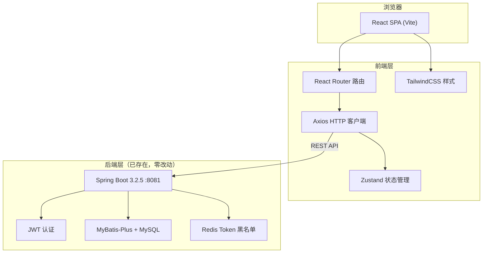

# HeecoMou Web 管理端 — 技术架构文档

> 版本：v1.0 | 日期：2026-05-24

---

## 1. 架构设计



**关键决策**：后端代码**零改动**，Web 前端完全通过现有 REST API 通信。前端独立部署（开发时 Vite dev server 端口 5173），通过 Vite proxy 转发 `/api` 请求到 `localhost:8081` 避免 CORS 问题。

---

## 2. 技术选型

| 类别 | 选择 | 原因 |
|------|------|------|
| **框架** | React 18 + TypeScript | 生态成熟，适合中型管理后台 |
| **构建工具** | Vite 5 | 开发体验快，HMR 极速 |
| **路由** | React Router 6 | 声明式路由，支持导航守卫 |
| **HTTP 客户端** | Axios | 拦截器支持 Token 自动刷新 |
| **状态管理** | Zustand | 极简 API，无 boilerplate，比 Redux 轻量 10x |
| **样式** | TailwindCSS 3 | 原子化CSS，快速构建一致设计 |
| **图标** | Lucide React | 轻量开源图标库 |
| **表单** | React Hook Form | 高性能表单，天然支持校验 |
| **后端** | Spring Boot 3.2.5（已存在） | 代码零改动 |

---

## 3. 路由定义

| 路由 | 页面 | 鉴权 |
|------|------|------|
| `/login` | 登录页 | 公开 |
| `/register` | 注册页 | 公开 |
| `/` | 首页（Dashboard） | 需登录 |
| `/profile` | 个人资料页 | 需登录 |
| `/password` | 修改密码页 | 需登录 |
| `/vocabulary` | 词库管理页（灰态占位） | 需登录 |

---

## 4. API 定义（后端已实现）

### 4.1 通用类型

```typescript
// 统一响应
interface ApiResponse<T> {
  code: number;
  message: string;
  data: T;
}

// 用户信息
interface UserVO {
  id: number;
  username: string;
  nickname: string | null;
  email: string;
  phone: string | null;
  avatarUrl: string | null;
  createdAt: string;
}
```

### 4.2 接口列表

| 方法 | 路径 | 请求类型 | 响应类型 | 鉴权 |
|------|------|---------|---------|------|
| `POST` | `/api/v1/auth/register` | `RegisterRequest` | `ApiResponse<UserVO>` | 无 |
| `POST` | `/api/v1/auth/login` | `LoginRequest` | `ApiResponse<LoginResponse>` | 无 |
| `POST` | `/api/v1/auth/refresh` | `RefreshRequest` | `ApiResponse<LoginResponse>` | 无 |
| `POST` | `/api/v1/auth/logout` | 无 | `ApiResponse<null>` | Bearer |
| `GET` | `/api/v1/user/me` | 无 | `ApiResponse<UserVO>` | Bearer |
| `PUT` | `/api/v1/user/profile` | `UpdateProfileRequest` | `ApiResponse<UserVO>` | Bearer |
| `PUT` | `/api/v1/user/password` | `ChangePasswordRequest` | `ApiResponse<null>` | Bearer |

### 4.3 请求/响应类型

```typescript
interface RegisterRequest {
  username: string;  // 3-20 字符, [a-zA-Z0-9_]
  password: string;  // 6-30 字符
  email: string;     // 合法邮箱格式
}

interface LoginRequest {
  username: string;
  password: string;
}

interface LoginResponse {
  accessToken: string;
  refreshToken: string;
  tokenType: "Bearer";
  expiresIn: number;   // 秒
  userId: number;
  username: string;
}

interface RefreshRequest {
  refreshToken: string;
}

interface UpdateProfileRequest {
  nickname?: string;    // max 50
  email?: string;
  avatarUrl?: string;   // max 500
}

interface ChangePasswordRequest {
  oldPassword: string;
  newPassword: string;  // 6-30
}
```

---

## 5. 前端数据模型

### 5.1 Zustand Store 设计

```typescript
interface AuthState {
  accessToken: string | null;
  refreshToken: string | null;
  user: UserVO | null;
  isAuthenticated: boolean;

  login: (req: LoginRequest) => Promise<void>;
  register: (req: RegisterRequest) => Promise<void>;
  logout: () => Promise<void>;
  fetchUser: () => Promise<void>;
  updateProfile: (req: UpdateProfileRequest) => Promise<void>;
  setTokens: (access: string, refresh: string) => void;
  clearAuth: () => void;
}
```

### 5.2 Token 持久化策略

```
localStorage:
  ├── access_token   → JWT access token
  ├── refresh_token  → JWT refresh token
  └── user           → JSON.stringify(UserVO) 缓存
```

刷新流程：Axios 响应拦截器检测 401 → 调用 `/api/v1/auth/refresh` → 更新 localStorage → 重试原请求。刷新失败 → 清除全部 Token → 跳转 `/login`。

---

## 6. 目录结构

```
frontend-web/
├── index.html
├── package.json
├── tsconfig.json
├── vite.config.ts
├── tailwind.config.js
├── postcss.config.js
├── public/
│   └── favicon.svg
└── src/
    ├── main.tsx                    # 入口
    ├── App.tsx                     # 根组件 + 路由
    ├── index.css                    # Tailwind 指令 + 全局样式
    ├── api/
    │   └── client.ts               # Axios 实例 + 拦截器
    ├── stores/
    │   └── authStore.ts            # Zustand auth 状态
    ├── components/
    │   ├── Layout.tsx              # 主布局（导航栏 + 内容区）
    │   ├── ProtectedRoute.tsx      # 鉴权路由守卫
    │   └── Toast.tsx               # 全局提示组件
    └── pages/
        ├── LoginPage.tsx
        ├── RegisterPage.tsx
        ├── DashboardPage.tsx
        ├── ProfilePage.tsx
        ├── PasswordPage.tsx
        └── VocabularyPage.tsx      # 占位页
```

---

## 7. Vite 代理配置

```typescript
// vite.config.ts
export default defineConfig({
  server: {
    port: 5173,
    proxy: {
      '/api': {
        target: 'http://localhost:8081',
        changeOrigin: true,
      },
    },
  },
});
```

开发时前端请求 `/api/v1/...` 自动转发到 Java 后端 8081 端口，避免跨域配置。

---

## 8. 启动说明

```bash
# 1. 启动后端（确保 MySQL + Redis 已运行）
cd backend-java && mvn spring-boot:run

# 2. 启动前端
cd frontend-web && npm install && npm run dev

# 3. 浏览器访问
# http://localhost:5173
```
